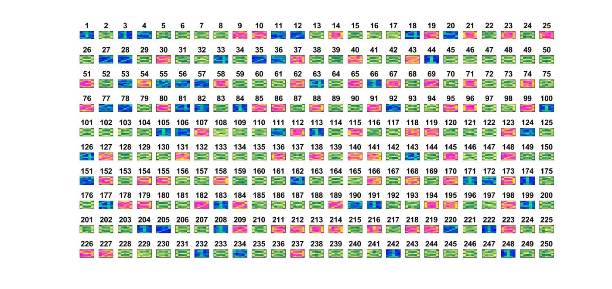

```{r setup, include=FALSE}
knitr::opts_chunk$set(echo = FALSE)
```

En aquesta pràctica hem realitzat una xarxa neuronal que pretén identificar els digits del 0 al 9 mitjançant l'optimització d'una funció Loss utilitzant 3 mètodes diferents: el Mètode del Gradient, el Mètode Quasi Newton BFGS, i per últim, el Mètode del Gradient Estocàstic.

Podem comprovar en primer lloc, que la funcio que estarem minimitzant és convexa, ja que la seva hessiana és semidefinida positiva. Aquest fet ens permet estar segurs dels resultats dels mètodes ja que sol existrirà un mínim local i global.

Hem realitzat dos vegades aquest experiment, modificant el SGM. A l'hora de trobar la direcció $d$, en un cas la dividiem pel tamany de la mostra utilitzada per trobar l'aproximació del gradient i en l'altre cas no. Comparant els resultats hem observat que obteniem un millor rendiment en el primer cas, així com millor precisió. Per aquesta raó hem decidit treballar amb el primer cas ja que només es tracta d'un escalat dels valors.

Les seeds utilitzades en aquest report són, per al $training$: 369354 i per al $test$: 169306


*Carreguem les dades*

```{r}
dd <- read.csv("./uo_nn_batch_369354-169306 (3).csv", sep = ";")
head(dd)
```

Observem que al llegir les dades el nom de les columnes ens queda desplaçat, corretgim aquest error i afegim una nova variable $speed$ que utilitzarem més endavant.

```{r}
names=colnames(dd)[2:9]
dd=dd[,-9]
colnames(dd)=names
dd$speed=dd$tex/dd$niter
head(dd)
```

\clearpage
## Part 1

*Convergència dels algoritmes:* primerament, estudiarem la convergència global i local dels tres algoritmes a partir de la funció objectiu $L$.

**a) Convergència Global**


```{r}
means_1=c()
means_3=c()
means_7=c()

for(i in c(0,1,10)){
  means_1=c(means_1, mean(dd[dd$isd==1 & dd$la==i,]$L.))
  means_3=c(means_3, mean(dd[dd$isd==3 & dd$la==i,]$L.))
  means_7=c(means_7, mean(dd[dd$isd==7 & dd$la==i,]$L.))
}

plot(x=c(0,1,10), y=c(means_1), col=c("red"), type="l", ylim=c(0,50), main="Mitjana del valor de L* per cada lambda", xlab="Valor de lambda", ylab="Valor de L*")
points(x=c(0,1,10), means_1, col="red", pch=1)
lines(x=c(0,1,10), means_1, col="red")
points(x=c(0,1,10), means_3, col="blue", pch=3)
lines(x=c(0,1,10), means_3, col="blue")
points(x=c(0,1,10), means_7, col="green", pch=4)
lines(x=c(0,1,10), means_7, col="green")
legend('topleft', legend=c("GM","QNM", "SGM"),fill=c("red","blue","green"))
```

```{r}
aux=dd[dd$niter==1000,]$isd
no_conv=c(sum(aux==1),sum(aux==3),sum(aux==7))
no_conv=as.data.frame(no_conv)
rownames(no_conv)=c("GM","QNM","SGM")
no_conv
```

Com es pot observar, el mètode del gradient estocàstic no arriba mai al punt òptim abans de les 1000 iteracions, com podem observar també en la gràfica anterior, ja que el punt on acaba sempre és superior als òptims trobats pels altres dos mètodes.

El mètode Quasi Newton sempre acaba abans de les 1000 iteracions i convergeix globalment.

El mètode del gradient observem que en alguns casos no arriba a la solució abans de les 1000 iteracions, podem buscar en quins casos son:

```{r}
dd[dd$niter==1000 & dd$isd==1,]
```

Es detecta que aquest fet succeeix sovint quan el valor de $\lambda$ és igual a 0, però encara que en aquests casos no convergeixi, el valor de la funció objectiu en la ultima iteració és molt proper a l'òptim com podem comprovar en la gràfica ja que els valors de la funció objectiu utilitzant aquest mètode són molt semblants als del mètode Quasi-Newton, que si que convergeix.

També podem observar que al augmentar la $\lambda$, el valor del punt òptim de la funció objectiu augmenta. De la mateixa manera quan la $\lambda$ augemnta, el mètode del Gradient Estocàstic queda més lluny de l'òptim.

**b) Convergència Local **

```{r}
means_1=c()
means_3=c()
means_7=c()
#for the first algorithm
for(i in c(0,1,10)){
  means_1=c(means_1, mean(dd[dd$isd==1 & dd$la==i,]$speed))
  means_3=c(means_3, mean(dd[dd$isd==3 & dd$la==i,]$speed))
  means_7=c(means_7, mean(dd[dd$isd==7 & dd$la==i,]$speed))
}

plot(x=c(0,1,10), y=c(means_1), col=c("red"), type="l", ylim=c(0,0.0072), main="Mitjana de temps/iteració per cada lambda", xlab="Valor de lambda", ylab="temps/iteració")
points(x=c(0,1,10), means_1, col="red", pch=1)
lines(x=c(0,1,10), means_1, col="red")
points(x=c(0,1,10), means_3, col="blue", pch=3)
lines(x=c(0,1,10), means_3, col="blue")
points(x=c(0,1,10), means_7, col="green", pch=4)
lines(x=c(0,1,10), means_7, col="green")
legend('right', legend=c("GM","QNM", "SGM"),fill=c("red","blue","green"))
```

```{r}
local_conv=c(mean(means_1), mean(means_3), mean(means_7))
local_conv=as.data.frame(local_conv)
rownames(local_conv)=c("GM","QNM","SGM")
local_conv
```

El mètode que va més ràpid és el SGM, aixo es deu a que fa els càlculs amb una part de les dades per calcular el gradient de manera aproximada però amb menys temps.

El GM és el segon més ràpid cosa que podiem esperar perque realitza els mateixos càlculs que el mètode del gradient però amb totes les dades, de manera que troba el gradient exacte a cada iteració.

Per últim el QNM és el més lent ja que realitza càlculs extra a l'hora de buscar la direcció de descens i a més a més també ho fa amb totes les dades.
\clearpage
**c) Discusió **

**GM**

El mètode del gradient assegura la seva convergència global ja que per definició la $d$ és sempre de descens $d^k=-\nabla f^k < 0, \forall k$ i sempre es satisfà la CAC : $cos(-\nabla f^k,d^k) = cos(0) = 1 \geq \delta > 0, \forall k$.
Pel que fa a la convergència local, sabem que aquest metode convergeix linealment, és per això que en la majoria de casos troba el punt òptim en poques iteracions. De totes maneres, tal i com hem vist, no sempre acaba en menys de 1000 iteracions i això es deu a les variacions que el valor de lambda genera a la funció objectiu i a la seva Hessiana en el punt òptim.

**QNM**

Per aquest mètode també podem assegurar la convergència global tenint en compte com hem definit la matriu que utilitzem per calcular la direcció de descens. Com que aquesta matriu la calculem pel mètode de *BFGS update* estem aconseguint una aproxicació de la matriu Hessiana definida positiva si la longitud de pas satisfà les SWC. D'aquesta manera, la direcció és sempre de descens $(\nabla f^k)^t*d^k=-(\nabla f^k)^t*H^k BFGS * \nabla f^k < 0, \forall k$) A més a més, la CAC també es compleix sempre que la matriu $H^k BFGS$ sigui definida positiva i tingui una condició numèrica fitada superiorment per una constant positiva $cos(-\nabla f^k,d^k) \geq \delta > 0$.
Si considerem la convergència local del QNM, hem vist a les lliçons de teoria que és superlineal. Això fa que convergeixi en tots els experiments que hem realitzat i que a més a més, la mitjana d'iteracions que triga a trobar l'òptim és notablement més baixa que pels altres dos mètodes.

```{r}
iter_mean1 <- mean(dd[dd$isd==1,]$niter)
iter_mean3 <- mean(dd[dd$isd==3,]$niter)
iter_mean7 <- mean(dd[dd$isd==7,]$niter)
iter_mean=c(iter_mean1, iter_mean3, iter_mean7)
iter_mean=as.data.frame(iter_mean)
rownames(iter_mean)=c("GM","QNM","SGM")
iter_mean
```

**SGM**

En aquest mètode no podem garantir la convergència global i per tant tampoc la local ja que de la manera com definim la direcció $d$, utilitzant sol una part de les dades, no podem assegurar que la direcció que utilitzarem serà de descens. A més a més tampoc podrem garantir que complim les CAC. Es per això que veiem que el SGM sempre arriba a les 1000 interacions.

Si comparem totes tres metodologies podem concloure que segurament, la més adecuada pel que fa a l'eficiència és el mètode del gradient estocàstic amb $\lambda = 0$ ja que, malgrat no podem assegurar la seva convergència global, arriba a un valor de la funció molt proper a l'òptim real en polt poc temps.
\clearpage

## Part 2

*Precisió de reconeixement:* Ara analitzarem la precisió de reconeixement de la nostra xarxa neuronal comparant l'encert de test tant per cada $\lambda$-algoritme com per cada dígit de manera individual. 

**a)**

En primer lloc ens centrarem en la presició de cada algoritme per les diferents lambdes.

```{r}
means_1=c()
means_3=c()
means_7=c()
#for the first algorithm
for(i in c(0,1,10)){
  means_1=c(means_1, mean(dd[dd$isd==1 & dd$la==i,]$te_acc))
  means_3=c(means_3, mean(dd[dd$isd==3 & dd$la==i,]$te_acc))
  means_7=c(means_7, mean(dd[dd$isd==7 & dd$la==i,]$te_acc))
}

plot(x=c(0,1,10), y=c(means_1), col=c("red"), type="l", main="Test accuracy per cada lambda", xlab="Valor de lambda", ylab="Valor de TE acc", ylim=c(80,100))
lines(x=c(0,1,10), means_1, col="red")
points(x=c(0,1,10), means_1, col="red", pch=1)
lines(x=c(0,1,10), means_3, col="blue")
points(x=c(0,1,10), means_3, col="blue", pch=3)
lines(x=c(0,1,10), means_7, col="green")
points(x=c(0,1,10), means_7, col="green", pch=4)
legend('bottomleft', legend=c("GM","QNM", "SGM"),fill=c("red","blue","green"))
```

Com es pot observar al gràfic, amb $\lambda = 0$ tots tres algoritmes mostren un bon percentatge d'encert. A mesura que la lambda creix, el GM i el QNM  mantenen o inclús milloren la seva precisió, en canvi el SGM empitjora molt notablement.

Ara compararem la presició d'encert per cada dígit de manera individual per tots tres mètodes.

```{r}
means_1=c()
means_3=c()
means_7=c()
for(i in c(0,1,2,3,4,5,6,7,8,9)){
  means_1=c(means_1, mean(dd[dd$isd==1 & dd$num_target==i,]$te_acc))
  means_3=c(means_3, mean(dd[dd$isd==3 & dd$num_target==i,]$te_acc))
  means_7=c(means_7, mean(dd[dd$isd==7 & dd$num_target==i,]$te_acc))
}

plot(x=c(0,1,2,3,4,5,6,7,8,9), y=c(means_1), col=c("red"), type="l", main="Test accuracy per cada Número", xlab="Valor del número", ylab="% de TE acc", ylim=c(80,100), xlim=c(0,9))
lines(x=c(0,1,2,3,4,5,6,7,8,9), means_1, col="red")
points(x=c(0,1,2,3,4,5,6,7,8,9), means_1, col="red", pch=1)
lines(x=c(0,1,2,3,4,5,6,7,8,9), means_3, col="blue")
points(x=c(0,1,2,3,4,5,6,7,8,9), means_3, col="blue", pch=3)
lines(x=c(0,1,2,3,4,5,6,7,8,9), means_7, col="green")
points(x=c(0,1,2,3,4,5,6,7,8,9), means_7, col="green", pch=4)
legend('bottomleft', legend=c("GM","QNM", "SGM"),fill=c("red","blue","green"))
```

Si observem els resultats podem concloure que els nombres més difícils de reconeixer són el $0$, el $3$ i el $8$ per tots tres mètodes. Això es deu a que tenen formes molt similars i per tant són dificils de diferenciar. També podem veure que en general, sense tenir en compte els diferents valors de $\lambda$, el SGM és el mètode que presenta un error de test més alt. 

A continuació realitzarem el mateix anàlisi que abans, presició d'encert per cada dígit de manera individual, però diferenciant cada valor de $\lambda$ per veure com actuen els diferents mètodes en funció d'aquest paràmetre i quin és el seu valor òptim.

```{r}
#par(mfrow=c(2,2))


for(i in c(0,1,10)){

te_1=dd[dd$isd==1 & dd$la==i,]$te_acc
te_3=dd[dd$isd==3 & dd$la==i,]$te_acc
te_7=dd[dd$isd==7 & dd$la==i,]$te_acc

te_1 <- te_1[c(10,1,2,3,4,5,6,7,8,9)]
te_3 <- te_3[c(10,1,2,3,4,5,6,7,8,9)]
te_7 <- te_7[c(10,1,2,3,4,5,6,7,8,9)]

plot(x=c(0,1,2,3,4,5,6,7,8,9), y=c(te_1), col=c("red"), type="l", main=paste("Test accuracy per lambda = ",i), xlab="Valor del número", ylab="% de TE acc", ylim=c(70,100), xlim=c(0,9))
points(x=c(0,1,2,3,4,5,6,7,8,9), te_1, col="red", pch=1)
lines(x=c(0,1,2,3,4,5,6,7,8,9), te_1, col="red")
points(x=c(0,1,2,3,4,5,6,7,8,9), te_3, col="blue", pch=3)
lines(x=c(0,1,2,3,4,5,6,7,8,9), te_3, col="blue")
points(x=c(0,1,2,3,4,5,6,7,8,9), te_7, col="green", pch=4)
lines(x=c(0,1,2,3,4,5,6,7,8,9), te_7, col="green")
legend('bottomleft', legend=c("GM","QNM", "SGM"),fill=c("red","blue","green"))
}
```

Aquests tres gràfic són molt útils ja que encara que abans podíem pensar que el mètode de SGM cometia molt error, veiem que per $\lambda = 0$ és el que més encert presenta. De totes maneres, a mesura que la $\lambda$ augmenta, la presició d'encert del SGM disminueix dràsticament, cometent errors molt grans pel cas de $\lambda = 10$. Podem relacionar aquest fet amb el primer gràfic que hem realitzat, on podíem observar com al augmentar el valor de $\lambda$, el valor de la funció objectiu que aquest mètode oferia després de les 1000 iteracions quedava molt lluny de l'òptim real. Per contra, els altres dos mètodes mantenen o inclús milloren el seu rendiment en termes generals. Una altra vegada veiem com ens dígits més difícils de diferenciar són el $0$, el $3$ i el $8$.

Un cop hem completat aquest anàlisi, el $\lambda$-algoritme que ens ofereix una major presició és el SGM amb $\lambda = 0$, a més a més, aquest mètode té un temps d'execició molt petit tal i com havíem vist anteriorment. Per tant, recomanaríem utilitzar aquesta combinació que ens ofereix resultats molt bons en molt poc temps.
\clearpage
**b)**

Ara calcularem la mitjana d'encert pel reconeixement de cada dígit independentment de l'algoritme i el valor de la $\lambda$.

```{r}
means=c()
for(i in c(0,1,2,3,4,5,6,7,8,9)){
  means=c(means, mean(dd[dd$num_target==i,]$te_acc))
}

plot(x=c(0,1,2,3,4,5,6,7,8,9), y=means, col=c("blue"), type="l", main="Test accuracy", xlab="Valor del número", ylab="% de TE acc", ylim=c(70,100), xlim=c(0,9))
points(x=c(0,1,2,3,4,5,6,7,8,9), means, col="blue", pch=1)

```

```{r}
means=as.data.frame(means)
rownames(means)=c(0,1,2,3,4,5,6,7,8,9)
means

```
Podem veure com el número $8$ és el més difícil de reconeixer independentment de l'algoritme i el valor de $\lambda$ usats.


A la imatge podem veure els resultats d'intentar reconeixer el número $8$ utilitzant l'algoritme SGM amb $\lambda = 10$. En verd, trobem tots aquells $8$ correctament identificats, en blau els dígits diferents de $8$ també ben classificats i en rosa els falsos positius. Per tant, veiem que el principal problema de detecció de $8$ recau en que la xarxa classifica molts dígits com a $8$ que realment no ho són. En canvi, no observem cap fals negatiu, l'algorisme no es deixa cap $8$ sense detectar.

Això es deu a que la seva forma es pot confondre fàcilment amb molts altres números i tots aquests es converteixen en falsos positius quan posem en marxa la nostra xarxa.

